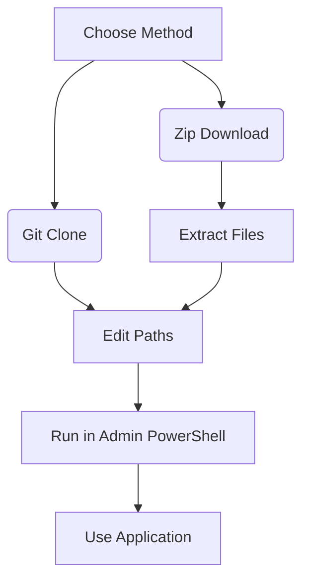
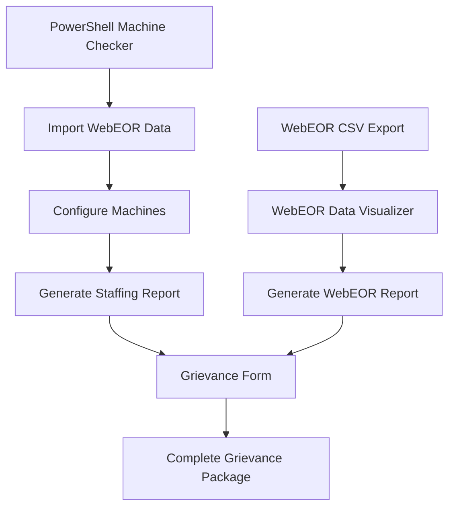

# APWU Machine Staffing Analysis System

A comprehensive PowerShell-based tool for analyzing machine staffing requirements and generating grievance documentation for the American Postal Workers Union (APWU).

## Table of Contents
1. [File Structure](#file-structure)
2. [Installation & Setup](#installation--setup)
3. [Data Sources & CSV Files](#data-sources--csv-files)
4. [Program Overview](#program-overview)
5. [HTML-Based Tools Overview](#html-based-tools-overview)
6. [WebEOR Data Visualizer](#webeor-data-visualizer)
7. [Enhanced Grievance Form System](#enhanced-grievance-form-system)
8. [Detailed Usage Guide](#detailed-usage-guide)
9. [Configure Dialog System](#configure-dialog-system)
10. [View Details Dialog System](#view-details-dialog-system)
11. [Report Generation](#report-generation)
12. [Technical Details](#technical-details)
13. [Troubleshooting](#troubleshooting)

---

## File Structure

```
Project Root/
├── Machine Checker.ps1                         # Main PowerShell application
├── Grievance Form.html                         # Self-contained grievance form (HTML/CSS/JS)
├── WebEOR Data Visualizer.html                 # Self-contained data analysis tool (HTML/CSS/JS)
├── Mapping CSVs/
│   ├── Machines_and_Acronyms.csv               # Machine type mappings
│   └── Machine_PubNum_Mappings.csv             # MMO/Class code mappings
├── Machine Labor Rubrics/
│   └── [MMO Directories]/                      # Labor lookup tables by MMO
│       ├── *-Labor-Lookup.csv                  # Lookup table to determine hours
│       ├── *-Staffing-Table.csv                # Current management provided staffing data
│       ├── *Calculated-Staffing-Table.csv      # Current staffing data based on real data
│       └── *.pdf                               # Reference MMO
└── Completed audits/                           # Generated reports output
    ├── Machine_Staffing_Report_*.html
    ├── webeor_analysis_report_*.html
    └── Grievance_*.html
```

---

## Installation & Setup

### Prerequisites
- Windows PowerShell 5.1 or higher
- .NET Framework 4.5 or higher
- Write permissions to the project directory
- Web browser (for HTML tools)

### Initial Setup
1. **Create Directory Structure**: Ensure all folders exist as shown above
2. **Populate CSV Files**: Add machine mappings and MMO data
3. **Add Labor Rubrics**: Place MMO-specific files in appropriate directories
4. **Test PowerShell Execution**: Run `Get-ExecutionPolicy` - should allow scripts

### File Permissions
- Ensure read/write access to all directories
- PowerShell script must be able to create/modify CSV files
- HTML tools require browser file system access permissions

---

## Data Sources & CSV Files

### Required CSV Structure

#### `Machines_and_Acronyms.csv`
```csv
FullName,Acronym
"EMERGENCY SYSTEMS",EMERGENCY SYSTEMS
"ENHANCED PACKAGE PROCESSING SYSTEM",EPPS
"FLATS AUTOMATED CULLING SYSTEM FOR PSM",FACS
"FLATS ANALYTICS CROSS-OVER SERVER",FLAX
"FIXED MECHANIZATION PROCESS CONTROL SYS",FMPCS
"FLATS REMOTE ENCODING SYSTEM",FRES
"FLEX ROVER SORTER",FRS
"FLATS SEQUENCING SYSTEM",FSS
"GLOBAL BUSINESS SYSTEM",GBS
"HAMPER DUMPER",HDUMP
```

#### `Machine_PubNum_Mappings.csv`
```csv
Acronym,Class Code,Pub Num
ATC,AA,MMO-007-24
ATSII,AA,MMO-132-11
ATSU,AA,MMO-132-11
ATU,AA,MMO-017-16
BAILER,AA,MMO-095-01
BCS,AA,MMO-025-02
BCS,DA,MMO-138-98
BCS,EA,MMO-111-13
BDS,AA,MMO-003-24
BDS,AA,MMO-004-24
CBS,AA,MMO-093-14
CCTV,AA,MMO-056-98
```

#### Labor Lookup Tables (`*-Labor-Lookup.csv`)
```csv
Stackers,Tours/Day,Operational Maintenance (hrs/yr),Total (hrs/yr)
4,1,194.13,2134.50
5,1,194.13,2141.59
6,1,194.13,2148.69
7,1,194.13,2155.80
8,1,194.13,2162.90
9,1,194.13,2169.99
10,1,194.13,2177.11
11,1,194.13,2184.21
12,1,194.13,2191.30
```

#### Staffing Tables (`*-Staffing-Table.csv`)
```csv
Machine ID,Input Column 1,Input Column 2,MM7,MPE9,ET10,Total (hrs/yr)
LCTS 1,6,2,730.13,730.13,730.13,2190.4
```

---

## Program Overview

### Main Application Flow
1. **Data Loading**: Imports CSV mappings and validates file structure
2. **Machine Entry**: Add machines manually or import from Web EOR data
3. **Configuration**: Set machine-specific parameters using MMO lookup tables
4. **Analysis**: Calculate staffing requirements vs. current allocations
5. **Reporting**: Generate HTML reports and grievance documentation

### Key Components
- **ListView Interface**: Displays all machines with their parameters
- **Configuration Engine**: Dynamically loads parameters based on MMO type
- **Calculation Engine**: Matches machine parameters to lookup tables
- **Report Generator**: Creates HTML reports with attached data
- **HTML Tools**: Standalone analysis and grievance management applications

---

## HTML-Based Tools Overview

The system includes three types of standalone HTML applications that can be used independently of the PowerShell application:

### 1. Grievance Form System (`Grievance Form.html`)
- **Purpose**: Create and manage APWU Step 1 grievance documentation
- **Self-contained**: All HTML, CSS, and JavaScript embedded in single file
- **Standalone Usage**: Can be opened directly in any modern web browser
- **No Dependencies**: Fully functional without external files

### 2. WebEOR Data Visualizer (`WebEOR Data Visualizer.html`)
- **Purpose**: Analyze and visualize postal machine operational data from WebEOR CSV exports
- **Self-contained**: Complete application with Chart.js integration in single file
- **Standalone Usage**: Independent data analysis tool requiring no other components
- **External CDN**: Uses Chart.js and date-fns from CDN for charting capabilities

### 3. Machine Staffing Reports (Generated)
- **Purpose**: Display comprehensive staffing analysis with attached supporting data
- **Generated by**: PowerShell application or saved from Grievance Form
- **Self-contained**: Includes all styling, data, and attached reports for offline viewing
- **Portable**: Can be shared as complete analysis packages

---

## WebEOR Data Visualizer

### Purpose & Features
The WebEOR Data Visualizer is a comprehensive web-based tool for analyzing postal machine operational data exported from WebEOR systems.

#### Core Capabilities
- **Multi-file Import**: Process multiple CSV files simultaneously from a directory
- **Data Deduplication**: Automatically removes duplicate records across files
- **Interactive Filtering**: Filter by date range, machines, tours, and sites
- **Real-time Visualization**: Six different chart types with dynamic updates
- **Advanced Analytics**: Machine performance trends, utilization patterns, and operational insights
- **Export Functionality**: Generate filtered datasets and comprehensive HTML reports

#### Supported Data Format
Processes WebEOR CSV exports with the following structure:
```csv
Site,MType,MNo,Op No.,Sort Program,Tour,Run#,Start,End,Fed,MODS,DOIS
"02301-9997","ATU","2","207000","ATU","2","3","04/21/24 07:00","04/21/24 15:00","765","S 04/21/24","NS"
```

#### Usage Workflow
1. **Data Import**: Select directory containing WebEOR CSV files
2. **Processing**: Automatic parsing, validation, and deduplication
3. **Analysis**: Use filters and charts to explore operational patterns
4. **Export**: Generate reports for Machine Staffing Report integration

#### Chart Types & Analytics
- **Machine Utilization by Type**: Pie chart showing mail volume distribution
- **Daily Activity Pattern**: Line chart tracking daily processing volumes
- **Machine Activity Over Time**: Step chart showing concurrent machine operations
- **Tour Activity Heatmap**: Bar chart with throughput overlay by hour
- **Performance Trends**: Line chart tracking machine efficiency over time
- **Operational Hours Distribution**: Pie chart showing tour-based workload distribution

#### Integration with Main System
- **Export Compatibility**: Generated reports use same format as PowerShell system
- **Grievance Form Integration**: Reports can be imported directly into Grievance Form
- **Data Validation**: Provides verification data for Machine Staffing Reports

### Technical Requirements
- **Browser Compatibility**: Chrome 80+, Firefox 75+, Edge 80+
- **File System Access**: Requires browser permission for directory selection
- **Memory Usage**: Handles datasets up to 10,000+ records efficiently
- **Performance**: Real-time chart updates for datasets under 5,000 records

---

## Enhanced Grievance Form System

### Architecture & Components

#### Self-Contained Design
- **Single File Architecture**: All HTML, CSS, and JavaScript embedded for portability
- **No External Dependencies**: Fully functional without additional files
- **Browser Compatibility**: Works in any modern web browser without setup
- **Offline Capable**: Can be used without internet connection

#### Advanced Import Capabilities

##### Machine Staffing Report Import
1. **File Validation**: Verifies HTML format and report structure
2. **Data Extraction**: Parses summary tables and machine discrepancy data
3. **Auto-Population**: Fills Background and Corrective Action sections automatically
4. **Content Preservation**: Maintains original report data for attachments

##### WebEOR Report Import  
1. **Dual Report Support**: Can import both Machine Staffing and WebEOR analysis reports
2. **Validation Cross-Check**: WebEOR data validates Machine Staffing Report accuracy
3. **Supporting Documentation**: Attaches reports as evidence without generating grievance text
4. **Data Integrity**: Preserves both reports for comprehensive documentation

### Opening the Grievance Form

#### From PowerShell Application
1. **Generate Report**: Click "Generate Report" button
2. **Report Completion**: Wait for "Report Generated" message
3. **Optional Opening**: Choose "Yes" to open grievance form automatically
4. **Manual Opening**: Double-click "Grievance Form.html" file

#### Standalone Usage
- **Direct Browser Opening**: Open HTML file in any modern browser
- **File Association**: Set browser as default for HTML files
- **Bookmark**: Save file location for quick access

### Grievance Form Interface

#### Form Structure
- **Header Section**: APWU logo and form identification
- **Data Table**: Standard grievance form fields (grievant info, dates, etc.)
- **Action Buttons**: Import, Save, Print, Clear functions
- **Content Sections**: Background, Corrective Action, Management Response
- **Status Area**: Success/error message display

#### Form Fields
All standard grievance form fields are included:
- **Grievant Information**: Name, address, contact details
- **Employment Details**: EIN, craft, status, level, step
- **Location Information**: Job location, postal installation
- **Case Details**: Discipline type, contract references, dates
- **Decision Information**: Step 1 decision maker and timeline

### Import Report Functionality

#### Import Process
1. **Click Import Buttons**: Separate buttons for Staffing and WebEOR reports
2. **File Validation**: Checks for HTML format and proper naming convention
3. **Content Parsing**: Extracts data from Machine Staffing Report
4. **Form Population**: Auto-fills Background and Corrective Action sections
5. **Status Confirmation**: Shows success/error message with import indicators

#### Data Extraction Logic

##### Report Date Extraction
```javascript
// Searches for: Generated: YYYY-MM-DD
const reportDateMatch = htmlContent.match(/Generated:\s*([0-9]{4}-[0-9]{2}-[0-9]{2})/);
```

##### Summary Table Processing
```javascript
// Locates summary table and extracts totals row
const summaryTable = doc.querySelector('.summary-table');
const totalRow = summaryTable.querySelector('tr.total-row');
```

##### Negative Value Identification
```javascript
// Finds machines with staffing deficits
if (!isNaN(totalDiffValue) && totalDiffValue < 0) {
    // Add to discrepancy list with MMO identification
}
```

#### Auto-Population Content

##### Background Section Template
```
Management has violated Article 19 of the National Agreement, specifically MMO-125-20, by failing to properly complete and/or implement the authorized staffing package.

FACTS:
- Current Machine Staffing Report dated [DATE] shows discrepancies
- Lists specific machines with negative values
- Total deficit: [VALUE] hours per year
- Breakdown by skill level (MM7, MPE9, ET10)
- Contract provisions violated
```

##### Corrective Action Template
```
Management shall complete proper staffing package within 30 days:
- Correct Tours/Day allocations
- Provide proper staffing hours for all categories
- Create and post duty assignments within 14 days
- Fill positions within 60 days
- Compensate for unworked hours at overtime rate
- Cease and desist future violations
```

### Save & Print Functionality

#### Save Process
1. **Data Collection**: Gathers all form field values and content sections
2. **Report Attachment**: Includes complete imported reports with styling
3. **HTML Generation**: Creates standalone HTML file with all data
4. **File Naming**: Uses imported report name and timestamp
5. **Download Trigger**: Initiates browser download

#### Print Process
1. **Report Attachment**: Temporarily displays imported reports in document
2. **Styling Application**: Applies complete CSS from original reports
3. **Print Dialog**: Triggers browser print interface
4. **Post-Print Cleanup**: Removes temporary report display

#### Content Preservation
- **Form Data**: All manual entries preserved
- **Imported Content**: Background and Corrective Action text maintained
- **Report Styling**: Complete CSS and formatting preserved
- **Interactive Elements**: Buttons and functionality maintained in saved files

---

## Detailed Setup & Usage Guide

**Method 1: Zip Download & Setup**
1. **Download ZIP**
   - Visit https://github.com/JRS222/LaborChecklist/tree/prod
   - Click the green "Code" button
   - Select "Download ZIP"
   - Save to preferred location (e.g., `Downloads`)

2. **Extract Files**
   - Right-click downloaded ZIP file
   - Select "Extract All..."
   - Choose destination folder (e.g., `C:\LaborChecklist-prod`)
   - Click "Extract"

3. **Update File Paths**
   - Navigate to extracted folder > open `Machine Checker.ps1` in:
     - **Notepad:** Right-click → "Edit"
     - **VS Code:** Right-click → "Open with Code"
   - Press `Ctrl+F` and search for:
     ```text
     C:\path\to\your\LaborChecklist
     ```
   - Replace ALL matches with your actual path (e.g., `C:\LaborChecklist-prod`)
   - Save changes (`Ctrl+S`)

### How to Find & Copy Your LaborChecklist Path

**For ZIP Method Users:**
1. **Locate Your Extracted Folder**
   - Open File Explorer (`Win+E`)
   - Navigate to where you extracted the ZIP (typically `Downloads` or a folder you specified)
   - Open the `LaborChecklist-prod` folder (or whatever you named it)

2. **Copy the Full Path**
   - Click in the **address bar** at the top of File Explorer
   - The path will appear (e.g., `C:\Users\YourName\Downloads\LaborChecklist-prod`)
   - Press `Ctrl+C` to copy it
   - **Alternative Method:**
     1. Hold `Shift` and right-click any empty space in the folder
     2. Select "Copy as path" (Windows 11) or "Copy address" (Windows 10)

**For Git Users:**
1. After running `git clone`, note the output - it shows where files were saved (typically where you ran the command)
2. Or navigate to the folder in File Explorer and copy the path as above

### Setup Instructions with Path Verification

**After Getting Your Path:**
1. **Paste Your Path Correctly**
   - When replacing in `Machine Checker.ps1`, ensure:
     - The path is in quotes: `"C:\Your\Path\LaborChecklist"`
     - Uses backslashes (`\`), not forward slashes (`/`)
     - No trailing slash: `"C:\Correct\Path"` not `"C:\Wrong\Path\"`

2. **Verify Your Path Works**
   - Test in PowerShell first:
     ```powershell
     Test-Path "C:\Your\Copied\Path\Machine Checker.ps1"
     ```
   - Should return `True` if correct

### Complete Path Replacement Example

1. In `Machine Checker.ps1`, press `Ctrl+H` (replace all) in editors like:
   - **Notepad++/VS Code:** Full replace function
   - **Regular Notepad:** Manually change each instance

2. Replace:
   ```text
   C:\path\to\your\LaborChecklist
   ```
   With your actual path (e.g.):
   ```text
   C:\Users\JohnDoe\Documents\LaborChecklist-prod
   ```

**Pro Tip:** If you see paths like `$env:USERPROFILE\...` in the script, leave those untouched - they're environment variables that auto-resolve.

### Path Troubleshooting Table

| Issue | Solution |
|-------|----------|
| "File not found" error | 1. Re-copy path from address bar<br>2. Check for typos<br>3. Verify the PS1 file exists there |
| Permission denied | Right-click folder → Properties → Security → Edit → Add "Users" with Full Control |
| Script won't run | 1. Unblock the file (right-click → Properties → Unblock)<br>2. Check execution policy |

4. **Run Application**
   - Press `Win+X` → Select "Terminal (Admin)"
   - Navigate to directory:
     ```powershell
     cd "C:\LaborChecklist-prod"
     ```
   - Run script:
     ```powershell
     .\Machine Checker.ps1
     ```
   - Confirm execution policy change if prompted:
     ```powershell
     Set-ExecutionPolicy Bypass -Scope Process -Force
     ```

**Method 2: Git Setup (Advanced)**
1. **Install Prerequisites**
   - Install Git: https://git-scm.com/download/win (use default options)
   - Create GitHub account: https://github.com/signup

2. **Clone Repository**
   - Open PowerShell as admin:
     ```powershell
     # Configure git (one-time setup)
     git config --global user.name "Your Name"
     git config --global user.email "your@email.com"
     
     # Clone project
     cd C:\
     git clone -b prod https://github.com/JRS222/LaborChecklist.git
     ```

3. **Update Paths & Run**
   - Follow *Step 3* above to modify `Machine Checker.ps1`
   - Execute using *Step 4* instructions

### Key Notes
- **Path Formatting:** Always use:
  - Backslashes: `\` (not `/`)
  - Quotes for paths with spaces: `"C:\My Projects\LaborChecklist"`
- **Security Warning:** First run may trigger antivirus due to PS1 file execution. Add exclusion if needed.
- **Execution Policy:** Resets automatically after PowerShell closes. Make permanent with:
  ```powershell
  Set-ExecutionPolicy RemoteSigned -Scope CurrentUser
  ```
- **Troubleshooting:**
  - If scripts are disabled, run:
    ```powershell
    Unblock-File -Path C:\Your\Path\*.ps1
    ```
  - Verify path case sensitivity (Windows is case-insensitive but best to match)

### Recommended Workflow


For frequent updates, Git method is preferred. For one-time use, ZIP method is simpler. Both methods require the same path replacement step before first execution.

### Adding Machines

#### Method 1: Manual Entry
1. **Select Machine Acronym**: Choose from dropdown (populated from CSV)
2. **Enter Machine Number**: Type unique identifier (e.g., "001", "A123")
3. **Click "Save"**: Adds machine to ListView with empty parameters
4. **Configure Parameters**: Use "Configure" button to set up machine details

#### Method 2: Import Web EOR Data
1. **Click "Import CSV"**: Opens folder dialog
2. **Select Web EOR File**: Choose folder containing exclusively CSVs with WEBEOR machine operational data
3. **Wait for Processing**: Progress bar shows import status
4. **Review Results**: 
   - Automatically calculates Tours/Day and Days/Week from historical data
   - Creates entries for all machines found in data
   - Shows orange text for adjusted values where standardization occurred

### Web EOR Import Details

#### Expected Data Format
```csv
Site,MType,MNo,Op No.,Sort Program,Tour,Run#,Start,End,Fed,MODS,DOIS
"02301-9997","ATU","2","207000","ATU","2","3","04/21/24 07:00","04/21/24 15:00","765","S 04/21/24","NS",
"02301-9997","LCTS","2","619000","619Z023T","2","1","04/21/24 07:00","04/21/24 15:00","2000","S 04/21/24","NS",
"02301-9997","LCTS","1","619000","619Z0231","2","1","04/21/24 07:00","04/21/24 15:00","440","S 04/21/24","NS",
"02301-9997","ATU","1","207000","ATU","2","2","04/21/24 07:00","04/21/24 15:00","421","S 04/21/24","NS",
"02301-9997","DIOSS","10","483000","483FIM00","2","1","04/21/24 07:06","04/21/24 08:53","34812","S 04/21/24","NS",
"02301-9997","DIOSS","6","483000","483FIM00","2","1","04/21/24 07:06","04/21/24 08:53","35509","S 04/21/24","NS",
"02301-9997","PSS","1","233000","PSS-RUN-233","2","1","04/21/24 07:13","04/21/24 07:32","27","S 04/21/24","NS",
"02301-9997","LCREM","1","490000","490F0023","2","1","04/21/24 07:43","04/21/24 09:44","3055","S 04/21/24","NS",
```

#### Import Processing
1. **Date Range Analysis**: Calculates total operational period
2. **Daily Metrics**: Groups data by machine and date
3. **Tour Calculation**: Counts distinct tours per day
4. **Days Calculation**: Averages operational days per week
5. **Standardization**: Rounds values to match available lookup table options
6. **Original Value Storage**: Preserves calculated values for reference

#### Import Results
- **Green Values**: Original calculated values
- **Orange Values**: Adjusted to match maintenance standards
- **Context Menu**: Right-click machines to view/toggle original vs. standard values

---

## Configure Dialog System

### Accessing Configuration
1. **Select Machine**: Click on machine in ListView
2. **Click "Configure"**: Opens configuration dialog
3. **Automatic Detection**: System finds appropriate MMO and parameters

### Configuration Process

#### Step 1: Class Code Selection
- **Dropdown Population**: Shows valid class codes for selected machine type
- **MMO Display**: Updates automatically based on class code selection
- **Lookup Table Loading**: Finds corresponding parameter definitions

#### Step 2: Parameter Configuration
Parameters are dynamically loaded based on the machine's MMO lookup table:

##### Common Parameters
- **Operation (days/wk)**: 5-7 days (affects all calculations)
- **Tours/Day**: 1-3 tours (determines operational intensity)

##### Machine-Specific Parameters
- **Stackers**: Number of stackers
- **Inductions**: Induction point count
- **LIM Modules**: LIM Count
- **Transports**: Transport count
- **Machine Type**: Some machines have variations within their own class code info. ATHS vs. NON-ATHS for example.
- **Site**: Location-specific identifier

#### Step 3: Value Adjustment Handling
- **Original Values Display**: Shows calculated values from import (if available)
- **Standardization Notes**: Indicates when values are adjusted for lookup compatibility
- **Color Coding**: Visual indication of adjusted vs. original values

#### Step 4: Validation & Save
- **Parameter Validation**: Ensures all required fields are completed
- **MMO Verification**: Confirms lookup table availability
- **ListView Update**: Refreshes display with new configuration

### Configuration Dialog Features

#### Dynamic Parameter Loading
```powershell
# System automatically:
1. Reads MMO lookup table headers
2. Identifies input vs. output columns
3. Gets unique values for dropdown population
4. Sets appropriate defaults
```

#### Value Standardization Logic
- **Tolerance Checking**: Compares original vs. available values
- **Best Match Selection**: Chooses closest available option
- **User Notification**: Shows original values alongside standardized ones
- **Adjustment Tracking**: Flags machines with adjusted values

---

## View Details Dialog System

### Accessing View Details
1. **Select Machine**: Choose configured machine from ListView
2. **Click "View Details"**: Opens detailed analysis dialog
3. **Tab Navigation**: Switch between different data views

### Tab Structure

#### Tab 1: Labor Lookup
- **Purpose**: Shows maintenance requirements lookup table
- **Data Source**: Loads from `*-Labor-Lookup.csv` in MMO directory
- **Highlighting**: Matches current machine parameters and highlights matching rows
- **Interaction**: Read-only reference data

#### Tab 2: Staffing Table
- **Purpose**: Current staffing assignments for machines
- **Data Source**: Loads from `*-Staffing-Table.csv` or creates it upon data entry
- **Editing**: Use "Edit Staffing Data" button to modify values
- **Machine Filtering**: Shows data for each machine.

#### Tab 3: Calculated Staffing Table
- **Purpose**: System-calculated staffing requirements
- **Generation**: Click "Calculate Staffing" to generate values
- **Comparison**: Shows calculated vs. current staffing
- **Export**: Option to save calculated values as `*-Calculated-Staffing-Table.csv`

### Staffing Table Editor

#### Opening the Editor
1. **From Staffing Tab**: Click "Edit Staffing Data"
2. **Validation Check**: System verifies MMO and lookup table availability
3. **Data Loading**: Loads existing staffing data if available

#### Editor Features
- **Machine ID Lock**: Machine ID field is read-only
- **Parameter Input**: All lookup table input columns available for editing
- **Management Hours**: MM7, MPE9, ET10 fields for workforce allocation
- **Auto-calculation**: Output columns calculated based on input parameters

#### Save Process
1. **Data Validation**: Ensures required fields are completed
2. **File Management**: Updates or creates staffing table CSV
3. **Multi-machine Support**: Preserves data for other machines in same MMO
4. **Directory Organization**: Saves to appropriate MMO subdirectory

### Calculate Staffing Feature

#### Calculation Process
1. **Parameter Matching**: Finds best match in labor lookup table using machine configuration
2. **Highlighting**: Shows matched row in labor lookup tab
3. **Value Extraction**: Copies output values (Total hrs/yr, Operational Maintenance hrs/yr)
4. **Management Distribution**: Allocates hours across MM7, MPE9, ET10 based on existing ratios
5. **Result Display**: Shows calculated values in grid format

#### Calculation Logic
```javascript
// Matching algorithm:
1. Compare each machine parameter with lookup table rows
2. Score matches (exact match = 10 points)
3. Calculate percentage match score
4. Select highest scoring row
5. Extract output values from matched row
```

#### Management Hour Distribution
- **Ratio Preservation**: Uses existing MM7:MPE9:ET10 ratios from staffing table
- **Proportional Allocation**: Distributes total hours based on historical ratios
- **Default Distribution**: Equal thirds if no historical data available

---

## Report Generation

### Generate Report Process
1. **Validation**: Verifies all machines have required staffing and calculated data
2. **Directory Search**: Finds all relevant MMO directories and data files
3. **Data Compilation**: Loads and processes all machine data
4. **Report Creation**: Generates comprehensive HTML report
5. **File Output**: Saves to "Completed audits" directory

### Report Structure

#### Report Header
- **Generation Timestamp**: Date and time of report creation
- **Machine Count**: Total machines included in analysis
- **Exclusion Warnings**: Lists machines missing required data

#### Machine Data Table
- **ListView Export**: All machine configurations and parameters
- **Column Mapping**: Direct export of interface data
- **Visual Formatting**: Maintains color coding for adjusted values

#### Staffing Tables Comparison
Organized by MMO, each section includes:
- **MMO Identification**: Directory name and machine count
- **Machine-by-Machine Analysis**: Row-by-row comparison of staffing vs. calculated values
- **Difference Calculation**: Staffing minus calculated values
- **Color Coding**: Green (surplus), Red (deficit), Black (equal)

#### Summary Table
- **Grouped Headers**: MM7, MPE9, ET10, Total Hours columns
- **Machine Rows**: Each machine's staffing vs. calculated comparison
- **Totals Row**: Sum of all differences across all machines
- **Visual Indicators**: Color-coded positive/negative values

### Report Features

#### Interactive Elements
- **Sortable Data**: Tables can be manipulated in browser
- **Print Optimization**: CSS designed for PDF generation
- **Responsive Design**: Adapts to different screen sizes

#### Data Integrity
- **Source Attribution**: Links back to original data files
- **Timestamp Tracking**: When data was last modified
- **Version Control**: Report generation parameters logged

---

## Technical Details

### PowerShell Architecture

#### Data Flow
```
CSV Files → Data Loading → ListView Population → Configuration → Calculation → Report Generation
```

#### Key Functions
- **Machine Classification**: `$machineClassCodes` hashtable lookup
- **Dynamic Parameter Loading**: `Get-RelevantParameters` function
- **Configuration Dialog**: `Show-MachineConfigDialog` with dynamic controls
- **Staffing Calculation**: `Calculate-StaffingRequirements` matching algorithm
- **Report Generation**: HTML template assembly with data injection

#### Error Handling
- **File Validation**: Checks for required CSV files and formats
- **Data Integrity**: Validates machine mappings and MMO availability
- **User Feedback**: Progress bars and status messages
- **Graceful Degradation**: Continues operation with missing optional data

### HTML Applications Architecture

#### Grievance Form (`Grievance Form.html`)
```javascript
// Global state management
let importedStaffingReportData = null;
let importedWebEORReportData = null;

// Core functions
- importStaffingReport(): File handling and validation
- importWebEORReport(): WebEOR report import
- parseStaffingReport(): HTML parsing and data extraction
- populateGrievanceForm(): Template population
- saveForm(): File generation with embedded reports
- printToPDF(): Print formatting and execution
```

#### WebEOR Visualizer (`WebEOR Data Visualizer.html`)
```javascript
// Data processing pipeline
- processFiles(): Multi-file CSV processing
- parseCSV(): CSV parsing with deduplication
- createCharts(): Six chart types with Chart.js
- applyFilters(): Real-time data filtering
- generateReport(): HTML report generation
```

#### DOM Manipulation
- **Content Editing**: Direct innerHTML manipulation for rich text
- **Form Handling**: Event listeners for input changes
- **Auto-save**: localStorage for session persistence
- **Validation**: Real-time form validation and feedback

#### Data Processing
- **HTML Parsing**: DOMParser for safe HTML content processing
- **Regular Expressions**: Pattern matching for data extraction
- **Array Processing**: Machine list filtering and formatting
- **Number Handling**: Float parsing with error checking

### CSS Architecture

#### Organization
```css
/* Base styles */
body, typography, layout

/* Component styles */
.form-table, .button-container, .section-content

/* Interactive states */
:hover, :focus, :active

/* Print styles */
@media print

/* Responsive design */
@media screen
```

#### Design Principles
- **Mobile-First**: Responsive design for various screen sizes
- **Print-Friendly**: Optimized for PDF generation
- **Accessibility**: High contrast and readable fonts
- **Professional**: APWU branding and color scheme

---

## Troubleshooting

### Common Issues

#### PowerShell Script Won't Run
**Symptoms**: Script execution blocked or security warnings
**Solutions**:
```powershell
# Check execution policy
Get-ExecutionPolicy

# Set execution policy (as Administrator)
Set-ExecutionPolicy RemoteSigned -Scope CurrentUser

# Unblock file if downloaded
Unblock-File ".\Machine Checker.ps1"
```

#### CSV Files Not Loading
**Symptoms**: Empty dropdowns or "File not found" errors
**Solutions**:
1. **Check File Paths**: Verify CSV files are in correct directories
2. **File Format**: Ensure CSV files have proper headers and formatting
3. **Permissions**: Verify read access to all directories
4. **File Encoding**: Save CSV files as UTF-8 with BOM

#### Configuration Dialog Empty
**Symptoms**: No parameters shown in Configure dialog
**Solutions**:
1. **MMO Directory**: Verify MMO directory exists in Labor Rubrics folder
2. **Lookup Table**: Ensure `*-Labor-Lookup.csv` file exists
3. **File Format**: Check CSV headers match expected format
4. **Class Code**: Verify machine has valid class code mapping

#### HTML Tools Issues

##### Grievance Form Problems
**Symptoms**: Import fails or form doesn't display correctly
**Solutions**:
1. **File Selection**: Ensure selected file is Machine Staffing Report HTML
2. **File Naming**: Check filename contains "machine_staffing_report" or "webeor_analysis_report"
3. **File Content**: Verify report has summary table with expected structure
4. **Browser Compatibility**: Use modern browser (Chrome 80+, Firefox 75+, Edge 80+)
5. **JavaScript Enabled**: Ensure browser allows JavaScript execution

##### WebEOR Visualizer Problems
**Symptoms**: Charts not loading or data processing fails
**Solutions**:
1. **Directory Selection**: Use "Select Directory" not individual files
2. **CSV Format**: Verify CSV files match expected WebEOR export format
3. **File Permissions**: Ensure browser has file system access permissions
4. **Memory Issues**: For large datasets (>10,000 records), use smaller date ranges
5. **CDN Access**: Ensure internet connection for Chart.js library loading

#### Import Report Fails
**Symptoms**: "Invalid format" error when importing HTML report
**Solutions**:
1. **File Selection**: Ensure selected file is correct report type
2. **File Naming**: Check filename follows expected naming convention
3. **File Content**: Verify report has required HTML structure
4. **Browser Security**: Allow local file access in browser settings
5. **File Corruption**: Re-generate report if import consistently fails

#### Saved Forms Don't Work
**Symptoms**: Saved grievance forms don't load properly or show corrupted data
**Solutions**:
1. **File Integrity**: Check saved file size - should be substantial with embedded reports
2. **Browser Compatibility**: Open in same browser type used for saving
3. **JavaScript Execution**: Ensure JavaScript is enabled for saved file
4. **Local File Restrictions**: Some browsers restrict local file JavaScript execution

### Debug Mode

#### PowerShell Debugging
```powershell
# Enable verbose logging
$VerbosePreference = "Continue"

# Check debug log files
Get-Content "$env:USERPROFILE\AppData\Local\Temp\MachineCheckerLogs\debug_log.txt"
```

#### HTML Applications Debugging
```javascript
// Open browser developer tools (F12)
// Check console for error messages
// Monitor network requests for file loading issues
// Verify localStorage data for auto-save functionality
```

#### WebEOR Visualizer Debugging
```javascript
// Check browser console for CSV parsing errors
// Verify file structure matches expected format
// Monitor memory usage for large datasets
// Check Chart.js CDN connectivity
```

### Performance Optimization

#### Large Data Sets
- **PowerShell Import**: For files with >1000 machines, expect 2-5 minute processing time
- **PowerShell Memory**: May use 500MB+ RAM for large datasets
- **HTML Reports**: Reports with >100 machines may be slow to render
- **WebEOR Processing**: Files with >5000 records may take 30+ seconds to process
- **Chart Rendering**: Large datasets may require filtered views for optimal performance

#### File Organization
- **Directory Structure**: Keep MMO directories organized and named consistently
- **File Sizes**: Large lookup tables (>1MB) may slow configuration loading
- **Report Archives**: Regularly archive old reports to maintain performance
- **Browser Cache**: Clear browser cache if HTML tools become sluggish

#### Browser Optimization
- **Memory Management**: Close unused tabs when working with large datasets
- **JavaScript Performance**: Disable browser extensions that may interfere
- **File System Access**: Grant permanent permissions to avoid repeated prompts
- **Print Performance**: Use print preview to verify formatting before generating PDFs

### Support Information

#### Version Information
- **PowerShell Version**: Requires PowerShell 5.1+
- **Browser Support**: Chrome 80+, Firefox 75+, Edge 80+
- **Operating System**: Windows 10/11, Windows Server 2016+
- **Chart.js Version**: 3.9.1 (loaded via CDN)
- **File API Support**: Modern File System Access API required

#### Log Files
- **PowerShell Logs**: `%USERPROFILE%\AppData\Local\Temp\MachineCheckerLogs\`
- **Browser Console**: F12 Developer Tools → Console tab
- **File Access**: Event Viewer → Windows Logs → Application
- **HTML Tool Errors**: Browser Developer Tools → Console tab

#### Contact Information
For technical support or feature requests:
- Review this documentation thoroughly
- Check log files for specific error messages
- Document steps to reproduce issues
- Include sample data files (with sensitive information removed)
- Note browser version and operating system details

---

## Appendix

### File Format Examples

#### Web EOR Data Format
```csv
Site,MType,MNo,Op No.,Sort Program,Tour,Run#,Start,End,Fed,MODS,DOIS
"02301-9997","ATU","2","207000","ATU","2","3","04/21/24 07:00","04/21/24 15:00","765","S 04/21/24","NS",
"02301-9997","LCTS","2","619000","619Z023T","2","1","04/21/24 07:00","04/21/24 15:00","2000","S 04/21/24","NS",
"02301-9997","LCTS","1","619000","619Z0231","2","1","04/21/24 07:00","04/21/24 15:00","440","S 04/21/24","NS",
"02301-9997","ATU","1","207000","ATU","2","2","04/21/24 07:00","04/21/24 15:00","421","S 04/21/24","NS",
"02301-9997","DIOSS","10","483000","483FIM00","2","1","04/21/24 07:06","04/21/24 08:53","34812","S 04/21/24","NS",
"02301-9997","DIOSS","6","483000","483FIM00","2","1","04/21/24 07:06","04/21/24 08:53","35509","S 04/21/24","NS",
"02301-9997","PSS","1","233000","PSS-RUN-233","2","1","04/21/24 07:13","04/21/24 07:32","27","S 04/21/24","NS",
"02301-9997","LCREM","1","490000","490F0023","2","1","04/21/24 07:43","04/21/24 09:44","3055","S 04/21/24","NS",
```

#### Labor Lookup Table Example
```csv
Operation (days/wk),Tours/Day,Operational Maintenance (hrs/yr),Total (hrs/yr)
5,1,251.33,1425.58
6,1,301.60,1672.90
7,1,351.87,1920.23
5,2,502.67,1676.92
6,2,603.20,1974.50
7,2,703.73,2272.09
5,3,754.00,1928.25
6,3,904.80,2276.10
7,3,1055.60,2623.96
```

#### Staffing Table Example
```csv
Machine ID,Operation (days/wk),Tours/Day,MM7,MPE9,ET10,Total (hrs/yr),Operational Maintenance (hrs/yr)
AFSM 001,6,2,730.13,730.13,730.13,2190.4,1752.32
AFSM 002,6,3,1095.2,1095.2,1095.2,3285.6,2628.48
BCS 001,7,2,851.82,851.82,851.82,2555.47,2044.38
```

#### WebEOR Analysis Report Example (Generated)
```html
<!DOCTYPE html>
<html>
<head>
    <title>WebEOR Analysis Report</title>
    <style>/* Embedded CSS */</style>
</head>
<body>
    <div class="header">
        <h1>WebEOR Data Analysis Report</h1>
        <p>Data range: 1/25/2024 to 5/17/2025</p>
    </div>
    
    <table>
        <tr>
            <th>Machine</th>
            <th>Total Runs</th>
            <th>Total Fed Count</th>
            <th>Avg Fed/Run</th>
            <th>Avg. Tours/Day</th>
            <th>Avg. Days/Week</th>
        </tr>
        <!-- Data rows -->
    </table>
</body>
</html>
```

### Regular Maintenance

#### Monthly Tasks
1. **Archive Reports**: Move old reports to archive directory
2. **Update CSV Files**: Add new machine types and class codes
3. **Verify Links**: Check that all MMO directories have required files
4. **Backup Data**: Create backup of entire project directory
5. **Browser Cleanup**: Clear cache and verify HTML tool functionality

#### Quarterly Tasks
1. **Review Lookup Tables**: Update maintenance requirements as needed
2. **Validate Calculations**: Spot-check calculated values against manual calculations
3. **Test Import Process**: Verify Web EOR import still works with current data format
4. **Documentation Review**: Update README with any process changes
5. **HTML Tool Updates**: Check for Chart.js updates and browser compatibility

#### Annual Tasks
1. **System Audit**: Complete review of all components and data accuracy
2. **Performance Review**: Analyze processing times and optimize as needed
3. **Security Review**: Update file permissions and execution policies
4. **Training Updates**: Review documentation and provide user training
5. **Backup Verification**: Test backup and recovery procedures

### Integration Workflows

#### Complete Analysis Workflow


#### Report Integration Process
1. **Data Collection**: Export WebEOR CSV files from postal systems
2. **Initial Analysis**: Use WebEOR Data Visualizer for operational insights
3. **Export Report**: Generate WebEOR analysis report
4. **PowerShell Processing**: Import data into Machine Checker for staffing analysis
5. **Staffing Report**: Generate comprehensive Machine Staffing Report
6. **Grievance Documentation**: Import both reports into Grievance Form
7. **Final Package**: Save complete grievance with all supporting documentation

---

*This documentation covers version 1.0 of the APWU Machine Staffing Analysis System. For updates and additional information, refer to the project repository or contact the development team.*