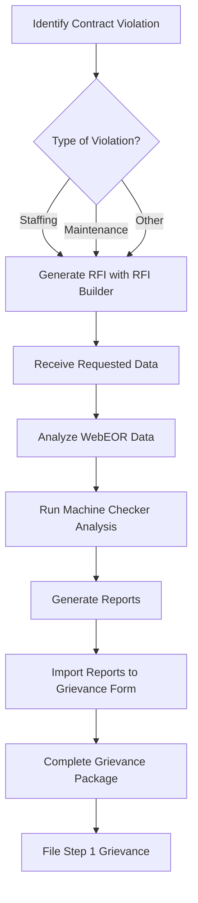
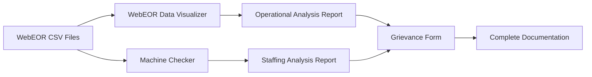

# APWU Grievance Documentation & Analysis System

A comprehensive suite of tools for American Postal Workers Union (APWU) representatives to analyze postal operations data, identify contract violations, and generate complete grievance documentation packages.

## System Overview

This integrated system provides APWU representatives with everything needed to:
- **Analyze** postal machine operational data from WebEOR exports
- **Calculate** proper staffing requirements using MMO standards
- **Identify** staffing discrepancies and contract violations
- **Generate** Request for Information (RFI) documents
- **Create** complete Step 1 grievance packages with supporting documentation
- **Document** various types of maintenance and staffing violations

## Table of Contents
1. [Quick Start Guide](#quick-start-guide)
2. [System Components](#system-components)
3. [Complete Workflow](#complete-workflow)
4. [Installation & Setup](#installation--setup)
5. [Component Details](#component-details)
6. [Data Sources & Formats](#data-sources--formats)
7. [Troubleshooting](#troubleshooting)
8. [Technical Specifications](#technical-specifications)

---

## Quick Start Guide

### For Grievance Documentation
1. **Identify the Issue**: Determine the type of violation (staffing, maintenance, etc.)
2. **Generate RFI**: Use `RFI Builder.html` to create initial information request
3. **Analyze Data**: 
   - Use `WebEOR Data Visualizer.html` for operational analysis
   - Use `Machine Checker.ps1` for staffing calculations
4. **Create Grievance**: Use `Grievance Form.html` to compile everything into a complete package

### For Quick Analysis Only
- **Operational Data**: Open `WebEOR Data Visualizer.html` → Import CSV files → Generate report
- **Staffing Analysis**: Run `Machine Checker.ps1` → Import data → Generate staffing report
- **RFI Creation**: Open `RFI Builder.html` → Select template → Fill details → Generate

---

## System Components

### 1. 📊 WebEOR Data Visualizer (`WebEOR Data Visualizer.html`)
**Purpose**: Analyze postal machine operational data from WebEOR CSV exports

**Key Features**:
- Multi-file CSV import with automatic deduplication
- 6 interactive chart types for operational insights
- Machine performance and utilization analysis
- Filters by date, machine, tour, and site
- Export filtered data and generate analysis reports

**Use Cases**:
- Identify machines with low utilization
- Track operational patterns and trends
- Document equipment performance issues
- Validate staffing calculations with actual usage

### 2. 📝 RFI Builder (`RFI Builder.html`)
**Purpose**: Generate legally formatted Request for Information documents

**Key Features**:
- 6 pre-configured templates for common violations
- Auto-populated legal citations and precedents
- APWU-branded professional formatting
- Save as HTML or print as PDF

**Templates Available**:
- eWHEP staffing package challenges
- General maintenance understaffing
- Custodial understaffing (MS-47)
- Preventive maintenance bypassing
- Maintenance coverage during operations
- Failure to complete staffing packages

### 3. 📋 Grievance Form (`Grievance Form.html`)
**Purpose**: Create complete Step 1 grievance documentation packages

**Key Features**:
- Import Machine Staffing Reports and WebEOR Analysis Reports
- Auto-populate grievance language based on imported data
- Attach supporting documentation within the grievance
- Save complete packages with embedded reports
- Print-ready formatting with proper pagination

**Integration**:
- Accepts reports from both PowerShell tool and WebEOR Visualizer
- Preserves all supporting documentation in a single file
- Maintains chain of evidence for grievance processing

### 4. 🔧 Machine Checker (`Machine Checker.ps1`)
**Purpose**: Calculate proper maintenance staffing based on MMO standards

**Key Features**:
- Import WebEOR data to determine machine usage
- Apply MMO lookup tables for staffing calculations
- Compare current vs. required staffing levels
- Generate detailed discrepancy reports
- Support for all machine types and configurations

**Output**:
- Machine Staffing Reports showing hour discrepancies
- Color-coded surplus/deficit visualization
- MMO-compliant calculations for grievances

### 5. 📂 Supporting Data Files
**CSV Mappings**:
- `Machines_and_Acronyms.csv`: Machine type definitions
- `Machine_PubNum_Mappings.csv`: MMO publication references
- Labor lookup tables per MMO specification
- Current and calculated staffing tables

---

## Complete Workflow

### Standard Grievance Process


### Quick Analysis Workflow


---

## Installation & Setup

### Prerequisites
- Windows 10/11 with PowerShell 5.1+
- Modern web browser (Chrome 80+, Firefox 75+, Edge 80+)
- Microsoft Excel or CSV editor
- Administrative privileges for PowerShell execution

### Quick Setup

#### Method 1: Download and Extract
1. **Download the project** from GitHub as ZIP
2. **Extract to a folder** (e.g., `C:\APWU-Grievance-System`)
3. **Update paths** in `Machine Checker.ps1`:
   - Open in text editor
   - Find and replace `C:\path\to\your\LaborChecklist` with your actual path
4. **Verify folder structure**:
   ```
   Your-Folder/
   ├── Machine Checker.ps1
   ├── Grievance Form.html
   ├── WebEOR Data Visualizer.html
   ├── RFI Builder.html
   ├── Mapping CSVs/
   └── Machine Labor Rubrics/
   ```

#### Method 2: Git Clone (Advanced)
```powershell
cd C:\
git clone -b prod https://github.com/JRS222/LaborChecklist.git APWU-Grievance-System
cd APWU-Grievance-System
# Update paths in Machine Checker.ps1 as above
```

### First Run
1. **For PowerShell Tool**:
   ```powershell
   # Run as Administrator
   Set-ExecutionPolicy Bypass -Scope Process -Force
   .\Machine Checker.ps1
   ```

2. **For HTML Tools**:
   - Simply double-click any `.html` file to open in browser
   - No installation or setup required
   - All tools are self-contained

---

## Component Details

### WebEOR Data Visualizer

#### Data Import Process
1. Click "Select Directory" and choose folder with WebEOR CSV files
2. System automatically processes all CSV files in the directory
3. Duplicates are removed across multiple files
4. Data is validated and parsed for analysis

#### Available Analytics
- **Machine Utilization**: Pie chart of mail volume by machine type
- **Daily Activity**: Line graph of processing volume over time
- **Machine Timeline**: Step chart showing concurrent operations
- **Tour Heatmap**: Hourly activity with throughput overlay
- **Performance Trends**: Top 5 machines tracked over time
- **Tour Distribution**: Workload distribution across tours

#### Report Generation
- Click "Generate Report" for comprehensive HTML analysis
- Includes machine-by-machine statistics
- Shows tours per day and days per week averages
- Identifies underutilized or inefficient machines

### RFI Builder

#### Using Templates
1. **Select Template**: Choose from dropdown based on violation type
2. **Fill Header Fields**: 
   - To/From names and titles
   - References (auto-populated but editable)
   - Particular need (urgency explanation)
3. **Add Facility Info**: Enter installation name
4. **Generate**: Creates formatted RFI with all legal citations

#### Template Customization
- All generated text is editable before saving
- Legal citations are automatically included
- Penalty information from recent cases included
- Professional APWU formatting applied

### Grievance Form

#### Import Capabilities
1. **Machine Staffing Report**:
   - Validates report structure
   - Extracts discrepancy data
   - Auto-populates Background with violation details
   - Auto-populates Corrective Action with remedies

2. **WebEOR Analysis Report**:
   - Serves as supporting documentation
   - Validates staffing calculations
   - Attached to grievance package
   - No text generation (validation only)

#### Form Sections
- **Header Table**: Standard grievance information fields
- **Background**: Auto-populated violation description
- **Corrective Action**: Auto-populated requested remedies  
- **Management Response**: Space for Step 1 response
- **Attachments**: Embedded supporting reports

#### Save Options
- **Save Form**: Downloads complete HTML with all data and attachments
- **Print as PDF**: Formats for printing with proper pagination
- **Auto-save**: Browser localStorage preserves work in progress

### Machine Checker (PowerShell)

#### Machine Configuration
1. **Add Machines**: Manual entry or CSV import
2. **Set Parameters**: 
   - Class code selection (determines MMO)
   - Operational days and tours
   - Machine-specific settings
3. **View Details**: 
   - Labor lookup tables
   - Current staffing
   - Calculated requirements

#### Staffing Calculations
- **Lookup Table Matching**: Finds best match for machine parameters
- **Hour Calculations**: Determines annual maintenance hours needed
- **Skill Distribution**: Allocates hours across MM7, MPE9, ET10
- **Discrepancy Analysis**: Compares required vs. actual staffing

#### Report Features
- **Color Coding**: Green (surplus), Red (deficit)
- **MMO Grouping**: Organized by maintenance publication
- **Summary Totals**: Overall staffing surplus/deficit
- **Machine Details**: Complete configuration for each machine

---

## Data Sources & Formats

### WebEOR CSV Format
```csv
Site,MType,MNo,Op No.,Sort Program,Tour,Run#,Start,End,Fed,MODS,DOIS
"02301-9997","ATU","2","207000","ATU","2","3","04/21/24 07:00","04/21/24 15:00","765","S 04/21/24","NS"
```

### Machine Mappings CSV
```csv
FullName,Acronym
"AUTOMATED FACER CANCELER SYSTEM",AFCS
"ADVANCED FACER CANCELER SYSTEM",AFCS100
```

### MMO Mappings CSV
```csv
Acronym,Class Code,Pub Num
AFCS,AA,MMO-058-21
AFCS100,AA,MMO-077-20
```

### Labor Lookup Table
```csv
Operational Days,Tours/Day,Operational Maintenance (hrs/yr),Total (hrs/yr)
5,1,251.33,1425.58
6,1,301.60,1672.90
7,1,351.87,1920.23
```

---

## Troubleshooting

### Common Issues

#### PowerShell Execution Blocked
```powershell
# Solution: Run as Administrator
Set-ExecutionPolicy Bypass -Scope Process -Force
# Or unblock the file
Unblock-File ".\Machine Checker.ps1"
```

#### HTML Tools Won't Open
- **Cause**: Browser blocking local file JavaScript
- **Solution**: Use Chrome/Edge and allow local file access
- **Alternative**: Host files on local web server

#### Import Failures
- **Machine Staffing Report**: Ensure filename contains "machine_staffing_report"
- **WebEOR Report**: Ensure filename contains "webeor_analysis_report"
- **CSV Files**: Check for proper headers and date formats

#### Large Dataset Performance
- **WebEOR Visualizer**: Limit date range for datasets >5,000 records
- **Machine Checker**: Import may take 2-5 minutes for >1,000 machines
- **Browser Memory**: Close other tabs when processing large files

### Debug Mode

#### Browser Console (F12)
- Check for JavaScript errors
- Monitor file loading progress
- Verify data parsing results

#### PowerShell Verbose Mode
```powershell
$VerbosePreference = "Continue"
.\Machine Checker.ps1
```

---

## Technical Specifications

### System Requirements
- **OS**: Windows 10/11, Server 2016+
- **PowerShell**: Version 5.1 or higher
- **Browser**: Chrome 80+, Firefox 75+, Edge 80+, Safari 14+
- **RAM**: 4GB minimum, 8GB recommended
- **Storage**: 500MB for application and data

### Browser Technologies Used
- **File System Access API**: For directory selection
- **localStorage**: For auto-save functionality
- **Chart.js 3.9.1**: For data visualization
- **DOMParser**: For HTML report parsing
- **Blob API**: For file generation

### Security Considerations
- **PowerShell**: Requires execution policy adjustment
- **File Access**: Browser requires permission for local files
- **Data Privacy**: All processing is local, no external transmission
- **Report Sharing**: Generated HTML files are self-contained

### Performance Benchmarks
- **CSV Import**: ~1,000 records/second
- **Chart Rendering**: <2 seconds for 5,000 data points
- **Report Generation**: <5 seconds for 100 machines
- **File Save**: Instant for reports <10MB

---

## Version History

### Current Version: 2.0
- **Added**: RFI Builder for information requests
- **Enhanced**: Grievance Form with dual report import
- **Improved**: WebEOR Visualizer with 6 chart types
- **Updated**: Machine Checker with better import handling

### Future Enhancements
- Cloud storage integration
- Multi-facility report consolidation
- Automated MMO update checking
- Mobile-responsive design improvements

---

## Support & Resources

### Documentation
- This README file
- Inline help in each application
- MMO reference PDFs in Machine Labor Rubrics folders

### Reporting Issues
When reporting problems, include:
1. Which tool has the issue
2. Steps to reproduce
3. Error messages (screenshot or text)
4. Sample data (remove sensitive information)
5. Browser/PowerShell version

### Contributing
This system is maintained by APWU representatives. To contribute:
1. Test changes thoroughly
2. Document new features
3. Maintain backwards compatibility
4. Follow existing code style

---

*APWU Grievance Documentation & Analysis System - Empowering union representatives with data-driven grievance tools*